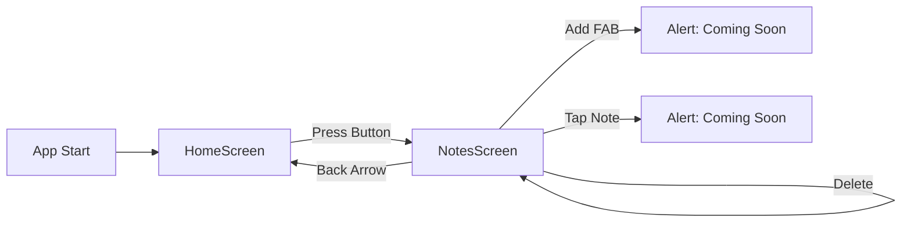

# 📝 Notes App - Project Summary

## ✅ What We've Built

### Navigation Structure Complete! 🎉

```
╔═══════════════════════════════════════╗
║         React Navigation Setup        ║
╠═══════════════════════════════════════╣
║                                       ║
║  📱 HomeScreen (Welcome)              ║
║     ├─ Welcome message                ║
║     ├─ Features list                  ║
║     └─ Navigate to Notes button       ║
║                                       ║
║           ⬇️ (Press Button)            ║
║                                       ║
║  📋 NotesScreen (Main App)            ║
║     ├─ Search bar                     ║
║     ├─ Notes list (FlatList)          ║
║     │   └─ NoteItem components        ║
║     ├─ Empty state                    ║
║     └─ FAB (+) button                 ║
║                                       ║
╚═══════════════════════════════════════╝
```

## 📂 Files Created

### Core Files
- ✅ **App.js** - Navigation container with Stack Navigator
- ✅ **index.js** - Updated with gesture handler import

### Screens
- ✅ **screens/HomeScreen.js** - Welcome screen (80 lines)
- ✅ **screens/NotesScreen.js** - Notes list with search (120 lines)

### Components
- ✅ **components/NoteItem.js** - Individual note card (60 lines)

### Documentation
- ✅ **NAVIGATION_SETUP.md** - Complete navigation guide
- ✅ **PROJECT_SUMMARY.md** - This file!

## 🎨 UI Features

### HomeScreen
```
┌─────────────────────────────────┐
│  📱 Notes App           (Header) │
├─────────────────────────────────┤
│                                 │
│   Welcome to Notes App          │
│   Organize your thoughts        │
│                                 │
│   ┌─────────────────────┐      │
│   │  View My Notes      │      │
│   └─────────────────────┘      │
│                                 │
│   ┌─────────────────────┐      │
│   │ Features:           │      │
│   │ ✓ Create notes      │      │
│   │ ✓ Organize          │      │
│   │ ✓ Search            │      │
│   │ ✓ Simple UI         │      │
│   └─────────────────────┘      │
│                                 │
└─────────────────────────────────┘
```

### NotesScreen
```
┌─────────────────────────────────┐
│  📋 My Notes            (Header) │
├─────────────────────────────────┤
│ 🔍 [Search notes...]           │
├─────────────────────────────────┤
│                                 │
│ ┌─────────────────────────┐    │
│ │ Shopping List       🗑️  │    │
│ │ Buy groceries...        │    │
│ │ 2025-10-06              │    │
│ └─────────────────────────┘    │
│                                 │
│ ┌─────────────────────────┐    │
│ │ Meeting Notes       🗑️  │    │
│ │ Discuss project...      │    │
│ │ 2025-10-07              │    │
│ └─────────────────────────┘    │
│                                 │
│ ┌─────────────────────────┐    │
│ │ Ideas               🗑️  │    │
│ │ New app features...     │    │
│ │ 2025-10-05              │    │
│ └─────────────────────────┘    │
│                                 │
│                            ┌───┐│
│                            │ + ││
│                            └───┘│
└─────────────────────────────────┘
```

## 🚀 Current Features

### Working Features ✅
1. **Navigation**
   - Navigate from Home to Notes
   - Back button to return to Home
   - Custom header styling

2. **Notes Display**
   - Display list of 3 sample notes
   - Scrollable list with FlatList
   - Card-based design

3. **Search**
   - Real-time search filter
   - Searches in title and content
   - Updates instantly

4. **Delete**
   - Delete button on each note (🗑️)
   - Confirmation dialog
   - Updates list immediately

5. **Empty State**
   - Shows message when no notes
   - Different message for search results

6. **UI/UX**
   - Modern, clean design
   - Orange-red theme (#f4511e)
   - Shadows and elevations
   - Responsive layout

### Placeholder Features 🚧
These show alerts and will be implemented next:
- Add new note (+ button)
- Edit note (tap on note)

## 📦 Dependencies Installed

```json
{
  "@react-navigation/native": "^6.x",
  "@react-navigation/stack": "^6.x",
  "react-native-screens": "^3.x",
  "react-native-safe-area-context": "^4.x",
  "react-native-gesture-handler": "^2.x"
}
```

## 🎯 How to Test

### 1. Start the app
```bash
npm start
# or
npx expo start
```

### 2. Test Navigation
- Open app → See HomeScreen
- Tap "View My Notes" → Navigate to NotesScreen
- Tap back arrow → Return to HomeScreen

### 3. Test Search
- On NotesScreen, type in search bar
- Watch notes filter in real-time
- Try searching: "shopping", "meeting", "ideas"

### 4. Test Delete
- Tap 🗑️ on any note
- See confirmation dialog
- Tap "Delete" → Note removed
- Tap "Cancel" → Note stays

### 5. Test Empty State
- Delete all notes
- See "No notes found" message
- Search for non-existent text
- See "Try a different search" message

## 📊 Code Statistics

| File | Lines | Purpose |
|------|-------|---------|
| App.js | 45 | Navigation setup |
| HomeScreen.js | 95 | Welcome screen |
| NotesScreen.js | 130 | Notes list + search |
| NoteItem.js | 65 | Note card component |
| **Total** | **335** | **Core functionality** |

## 🔄 Navigation Flow Diagram



## 🎨 Design System

### Colors
- **Primary**: #f4511e (Orange-Red)
- **Background**: #f5f5f5 (Light Gray)
- **Cards**: #ffffff (White)
- **Text Primary**: #333333
- **Text Secondary**: #666666
- **Text Tertiary**: #999999

### Typography
- **Title**: 32px, Bold
- **Subtitle**: 18px, Regular
- **Note Title**: 18px, Bold
- **Note Content**: 14px, Regular
- **Date**: 12px, Regular

### Spacing
- **Padding**: 15-20px
- **Margin**: 10-15px
- **Card Margin**: 15px bottom
- **Border Radius**: 10px

### Shadows
```javascript
elevation: 2-5,
shadowColor: "#000",
shadowOffset: { width: 0, height: 1-2 },
shadowOpacity: 0.2-0.3,
shadowRadius: 1.41-3.84,
```

## 🚀 Next Steps

To continue building the app, we'll need to add:

1. **Add Note Screen**
   - Form with title and content inputs
   - Save button
   - Cancel button

2. **Edit Note Screen**
   - Pre-fill form with existing data
   - Update functionality

3. **Persistent Storage**
   - AsyncStorage for data persistence
   - Save notes locally

4. **Advanced Features**
   - Categories/Tags
   - Sort options (date, title, etc.)
   - Dark mode
   - Note colors

## 💡 Key Learnings

### React Navigation
- Stack Navigator creates a navigation stack
- Each screen receives `navigation` prop automatically
- Use `navigation.navigate()` to move between screens
- Headers are customizable per screen

### Component Structure
- Separate screens and components
- Pass functions as props for actions
- Use FlatList for efficient list rendering
- Handle empty states gracefully

### State Management
- useState for local state
- Filter data on the fly
- Manage user interactions with callbacks

## 🎉 Success!

You now have a fully functional Notes App with:
- ✅ Navigation between screens
- ✅ Notes list display
- ✅ Search functionality
- ✅ Delete with confirmation
- ✅ Modern, responsive UI
- ✅ Proper project structure

**Ready to run:** Just start the development server and test it out!

```bash
npm start
```

---

📚 Check out `NAVIGATION_SETUP.md` for detailed documentation!
